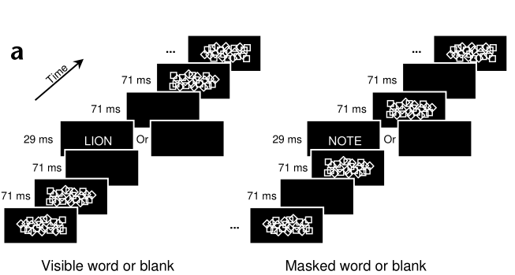

A visual word that is flashed for only a few tens of milliseconds remains readable. However, when the same word is presented in close spatial and temporal proximity with other visual stimuli, it becomes indistinct or even invisible, a perceptual phenomenon called masking.

Participants viewed a random series of masking shapes and blank screens. This continuous visual stream was briefly interrupted by a short presentation of words that participants were asked to name in their head. In one condition, the presence of blanks screens immediately surrounding temporally the words made them consciously perceptible and reportable. In the other condition, the order of the masks and blanks was reversed so that the words were surrounded by masks that rendered them invisible (see Figure below). Two control situations were created in which the temporal context was identical but the words were omitted. 

## Experiment 1. 

We generated for each participant lists of four-letter nouns, to be used respectively as masked words, unmasked words and 6 distractors for the recognition memory test. Masks were created by semi- random arrangements of diamond and square shapes with the same line thickness as the letter font used, covering up the central area of screen where words could appear.

Each of the four stimulus types (visible words, visible blanks, masked words and masked blanks) comprised a precisely timed sequence (Fig. 1a). To increase sensitivity, stimuli were grouped into 2400-ms-long trials comprising 4 stimuli of the same type presented at a 500-ms interval, with the rest of the trial filled up by random presentations of blanks (28% probability) or masks (72% probability), each appearing for a random duration of 43, 57 or 71 ms. 

The seamless succession of trials gave a subjective impression of a continuous stream of masks interrupted at random times by four flashed words. Each participant viewed a total of 5 streams, each comprising 5 leading blank trials followed by 30 trials of each type, randomly intermixed, for a total stream duration of 5 min. 
