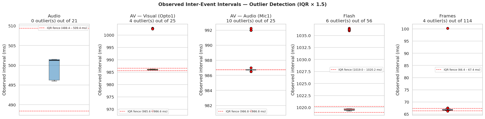
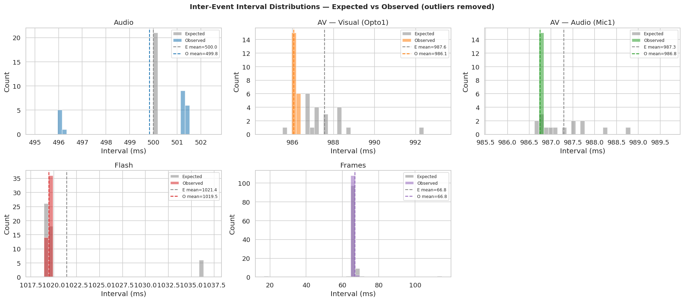
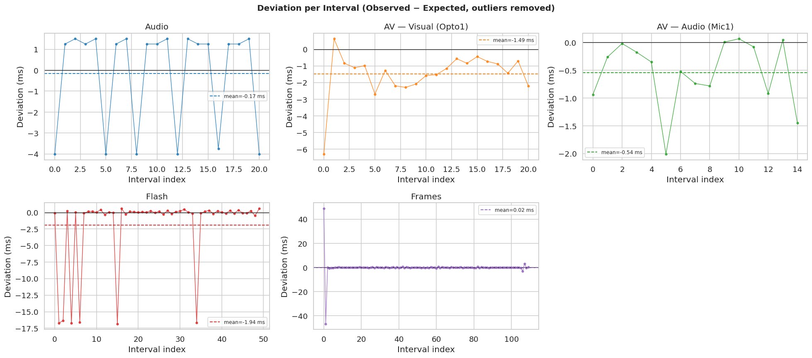
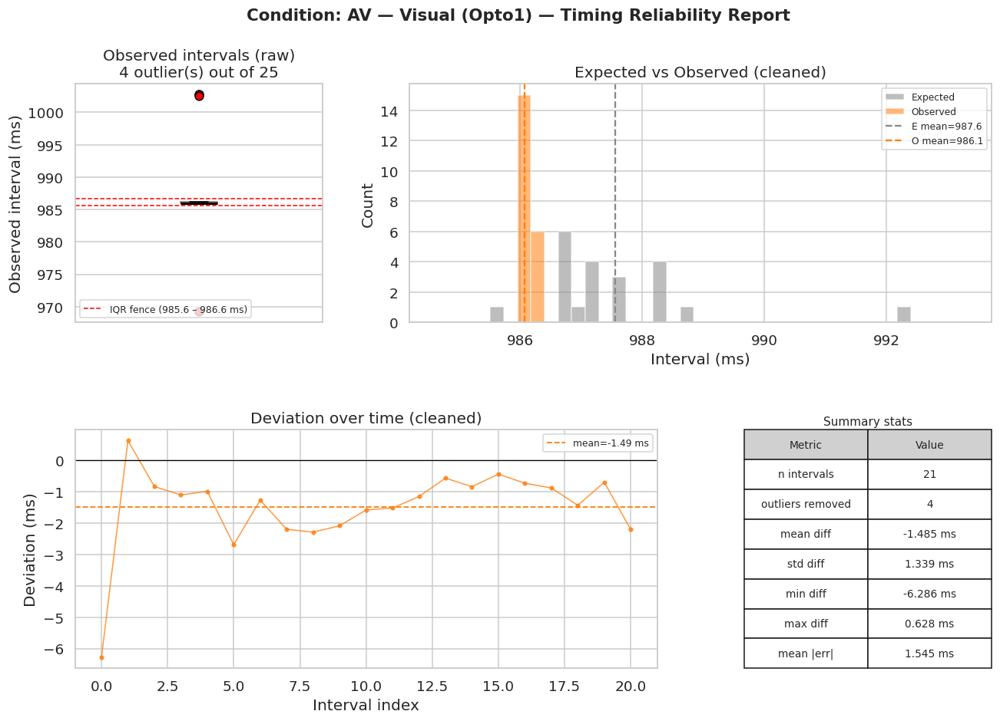

# BBTKv3 Timing Reliability — Full Report

> Experiment framework: **goxpyriment (devel)** — <http://chrplr.github.io/goxpyriment>  
> Measurement device: **Black Box Toolkit v3 (BBTKv3) — <https://github.com/chrplr/bbtkv3>  **  
> Report generated: 2026-04-02

---

## 1. Machine Information

| Category | Detail |
|----------|--------|
| **OS** | Ubuntu 22.04.5 LTS (Jammy Jellyfish) |
| **Kernel** | 6.12.3-061203-generic x86_64, 64-bit |
| **Desktop** | GNOME 42.9 |
| **Machine** | HP EliteBook 835 13 inch G10 Notebook PC (Laptop) |
| **Motherboard** | HP model 8C10, UEFI HP v83 Ver. 01.06.02 (2024-08-23) |
| **CPU** | AMD Ryzen 7 PRO 7840U w/ Radeon 780M Graphics — 8-core (MT MCP), 400–5132 MHz (avg 1403 MHz) |
| **GPU** | AMD (driver: amdgpu, kernel) |
| **Display** | Wayland / X.Org 1.22.1.1 + Xwayland 22.1.1, compositor: gnome-shell, gpu: amdgpu |
| **Resolution** | 2560×1440 |
| **OpenGL** | GFX1103_R1 — v4.6 Mesa 23.2.1, LLVM 15.0.7, DRM 3.59 |
| **Network** | Realtek (driver: rtw89_8852ce) |
| **RAM** | 30.63 GiB total, 8.56 GiB used (27.9%) at experiment time |

---

## 2. Software Environment

### 2.1 Runtime

| Parameter | Value |
|-----------|-------|
| **Framework** | goxpyriment (devel) |
| **SDL version** | 3.4.0 |
| **Video driver** | x11 |
| **Renderer** | opengl |
| **VSync** | 1 |

### 2.2 Audio subsystem

| Parameter | Value |
|-----------|-------|
| **Driver** | pulseaudio |
| **Format** | SDL_AUDIO_S16LE |
| **Sample rate** | 48000 Hz |
| **Channels** | 2 |
| **Buffer** | 768 frames (16.00 ms) |

### 2.3 Display

| Parameter | Value |
|-----------|-------|
| **Screen** | XWAYLAND0 27" |
| **Native resolution** | 2560x1440 |
| **Refresh rate** | 59.91 Hz |
| **Frame duration** | 16.692 ms |
| **Pixel format** | SDL_PIXELFORMAT_XRGB8888 |
| **Bits per pixel / channel** | 32 bpp / 8 bpc |

---

## 3. Experimental Conditions

### 3.1 Audio

| Parameter | Value |
|-----------|-------|
| **Start time** | 2026-04-01  14:09:27 |
| **End time** | 2026-04-01  14:09:42 |
| **Duration** | 00:00:15.015 |
| **Parameters** | `test=sound cycles=30 freq-hz=1000 tone-ms=50 iti-ms=450 soa-ms=500` |
| **Command line** | `…/main -test sound -cycles 30 -freq-hz 1000 -tone-ms 50 -iti-ms 450` |

| **BBTK sensor** | Mic1 (microphone) |
| **Reference column used** | `target_onset_ms` |

### 3.2 Audio-Visual (AV)

| Parameter | Value |
|-----------|-------|
| **Start time** | 2026-04-01  13:45:40 |
| **End time** | 2026-04-01  13:46:10 |
| **Duration** | 00:00:29.627 |
| **Parameters** | `(see command line)` |
| **Command line** | `…/main -test av -soa-ms 0 -freq-hz 1000 -tone-ms 50 -iti-ms 1000 -cycles 30` |

| **BBTK sensors** | Opto1 (photodiode) for visual; Mic1 (microphone) for audio |
| **Reference columns** | `t_visual_before_ms` (Opto1) / `t_audio_queued_ms` (Mic1) |
| **SOA** | 0 ms (simultaneous audio-visual) |

### 3.3 Flash

| Parameter | Value |
|-----------|-------|
| **Start time** | 2026-04-01  13:37:30 |
| **End time** | 2026-04-01  13:38:31 |
| **Duration** | 00:01:01.267 |
| **Parameters** | `test=flash level-a=0 level-b=255 isi-frames=60 cycles=60 hz=60.00 warmup=10` |
| **Command line** | `…/main -test flash -isi-frames 60 -cycles 60 -trigger-pin 1` |

| **BBTK sensor** | Opto1 (photodiode) |
| **Reference column used** | `t_before_ms` |

### 3.4 Frames

| Parameter | Value |
|-----------|-------|
| **Start time** | 2026-04-01  13:30:11 |
| **End time** | 2026-04-01  13:30:19 |
| **Duration** | 00:00:07.996 |
| **Parameters** | `test=frames level-a=0 level-b=255 frames-per-phase=2 cycles=120 hz=60.00 warmup=10` |
| **Command line** | `…/main -test frames -frames-per-phase 2 -cycles 120 -trigger-pin 1 -trigger-ms 5` |

| **BBTK sensor** | Opto1 (photodiode) |
| **Reference column used** | `t_before_ms` (triggered rows only) |

---

## 4. Results

> **Method:** Inter-event intervals = differences between consecutive onset values.
> Outliers detected on observed intervals via IQR × 1.5 rule and removed before cleaned statistics.
> Series trimmed to equal length when BBTK count < reference count (shortest wins).

### 4.1 Audio

#### Event counts

| | Count |
|:--|--:|
| Reference events | 30 |
| BBTKv3 events detected | 22 |
| Missed detections | **8** |
| Intervals compared (before outlier removal) | 21 |

#### Outlier detection (IQR × 1.5)

| | Value |
|:--|--:|
| Lower fence | 488.375 ms |
| Upper fence | 509.375 ms |
| Outliers detected | **0** |

| Intervals after cleaning | 21 |

#### Deviation statistics (observed − expected)

| Metric | Raw (all intervals) | Cleaned (outliers removed) |
|:-------|--------------------:|---------------------------:|
| n | 21 | 21 |
| Mean diff | -0.167 ms | -0.167 ms |
| Std diff | 2.460 ms | 2.460 ms |
| Min diff | -4.000 ms | -4.000 ms |
| Max diff | 1.500 ms | 1.500 ms |
| **Mean absolute error** | 2.095 ms | **2.095 ms** |

#### Descriptive statistics — cleaned intervals

| Statistic | Expected | Observed |
|:----------|:--------:|:--------:|
| n | 21 | 21 |
| Mean | 500.000 ms | 499.833 ms |
| Std | 0.000 ms | 2.460 ms |
| Min | 500.000 ms | 496.000 ms |
| P5 | 500.000 ms | 496.000 ms |
| P25 | 500.000 ms | 496.250 ms |
| Median | 500.000 ms | 501.250 ms |
| P75 | 500.000 ms | 501.500 ms |
| P95 | 500.000 ms | 501.500 ms |
| Max | 500.000 ms | 501.500 ms |

### 4.2 AV — Visual (Opto1)

#### Event counts

| | Count |
|:--|--:|
| Reference events | 30 |
| BBTKv3 events detected | 26 |
| Missed detections | **4** |
| Intervals compared (before outlier removal) | 25 |

#### Outlier detection (IQR × 1.5)

| | Value |
|:--|--:|
| Lower fence | 985.625 ms |
| Upper fence | 986.625 ms |
| Outliers detected | **4** |

| Outlier values | 969.250, 1002.500, 1002.750, 1002.750 ms |
| Intervals after cleaning | 21 |

#### Deviation statistics (observed − expected)

| Metric | Raw (all intervals) | Cleaned (outliers removed) |
|:-------|--------------------:|---------------------------:|
| n | 25 | 21 |
| Mean diff | -0.089 ms | -1.485 ms |
| Std diff | 6.847 ms | 1.339 ms |
| Min diff | -17.750 ms | -6.286 ms |
| Max diff | 15.964 ms | 0.628 ms |
| **Mean absolute error** | 3.877 ms | **1.545 ms** |

#### Descriptive statistics — cleaned intervals

| Statistic | Expected | Observed |
|:----------|:--------:|:--------:|
| n | 21 | 21 |
| Mean | 987.557 ms | 986.071 ms |
| Std | 1.306 ms | 0.116 ms |
| Min | 985.622 ms | 986.000 ms |
| P5 | 986.691 ms | 986.000 ms |
| P25 | 986.838 ms | 986.000 ms |
| Median | 987.240 ms | 986.000 ms |
| P75 | 988.199 ms | 986.250 ms |
| P95 | 988.691 ms | 986.250 ms |
| Max | 992.286 ms | 986.250 ms |

### 4.3 AV — Audio (Mic1)

#### Event counts

| | Count |
|:--|--:|
| Reference events | 30 |
| BBTKv3 events detected | 26 |
| Missed detections | **4** |
| Intervals compared (before outlier removal) | 25 |

#### Outlier detection (IQR × 1.5)

| | Value |
|:--|--:|
| Lower fence | 986.750 ms |
| Upper fence | 986.750 ms |
| Outliers detected | **10** |

| Outlier values | 981.250, 981.250, 986.500, 986.500, 987.000, 992.000, 992.000, 992.000, 992.000, 992.250 ms |
| Intervals after cleaning | 15 |

#### Deviation statistics (observed − expected)

| Metric | Raw (all intervals) | Cleaned (outliers removed) |
|:-------|--------------------:|---------------------------:|
| n | 25 | 15 |
| Mean diff | 0.065 ms | -0.541 ms |
| Std diff | 2.981 ms | 0.604 ms |
| Min diff | -6.902 ms | -2.007 ms |
| Max diff | 6.146 ms | 0.067 ms |
| **Mean absolute error** | 1.852 ms | **0.557 ms** |

#### Descriptive statistics — cleaned intervals

| Statistic | Expected | Observed |
|:----------|:--------:|:--------:|
| n | 15 | 15 |
| Mean | 987.291 ms | 986.750 ms |
| Std | 0.604 ms | 0.000 ms |
| Min | 986.683 ms | 986.750 ms |
| P5 | 986.699 ms | 986.750 ms |
| P25 | 986.798 ms | 986.750 ms |
| Median | 987.101 ms | 986.750 ms |
| P75 | 987.600 ms | 986.750 ms |
| P95 | 988.365 ms | 986.750 ms |
| Max | 988.757 ms | 986.750 ms |

### 4.4 Flash

#### Event counts

| | Count |
|:--|--:|
| Reference events | 60 |
| BBTKv3 events detected | 57 |
| Missed detections | **3** |
| Intervals compared (before outlier removal) | 56 |

#### Outlier detection (IQR × 1.5)

| | Value |
|:--|--:|
| Lower fence | 1018.969 ms |
| Upper fence | 1020.219 ms |
| Outliers detected | **6** |

| Outlier values | 1036.000, 1036.250, 1036.250, 1036.250, 1036.250, 1036.500 ms |
| Intervals after cleaning | 50 |

#### Deviation statistics (observed − expected)

| Metric | Raw (all intervals) | Cleaned (outliers removed) |
|:-------|--------------------:|---------------------------:|
| n | 56 | 50 |
| Mean diff | -0.227 ms | -1.938 ms |
| Std diff | 7.472 ms | 5.491 ms |
| Min diff | -16.821 ms | -16.821 ms |
| Max diff | 16.902 ms | 0.596 ms |
| **Mean absolute error** | 3.437 ms | **2.166 ms** |

#### Descriptive statistics — cleaned intervals

| Statistic | Expected | Observed |
|:----------|:--------:|:--------:|
| n | 50 | 50 |
| Mean | 1021.413 ms | 1019.475 ms |
| Std | 5.514 ms | 0.169 ms |
| Min | 1018.950 ms | 1019.250 ms |
| P5 | 1019.098 ms | 1019.250 ms |
| P25 | 1019.306 ms | 1019.250 ms |
| Median | 1019.432 ms | 1019.500 ms |
| P75 | 1019.595 ms | 1019.500 ms |
| P95 | 1036.188 ms | 1019.750 ms |
| Max | 1036.321 ms | 1019.750 ms |

### 4.5 Frames

#### Event counts

| | Count |
|:--|--:|
| Reference events | 120 |
| BBTKv3 events detected | 115 |
| Missed detections | **5** |
| Intervals compared (before outlier removal) | 114 |

#### Outlier detection (IQR × 1.5)

| | Value |
|:--|--:|
| Lower fence | 66.375 ms |
| Upper fence | 67.375 ms |
| Outliers detected | **4** |

| Outlier values | 66.250, 67.500, 67.500, 100.250 ms |
| Intervals after cleaning | 110 |

#### Deviation statistics (observed − expected)

| Metric | Raw (all intervals) | Cleaned (outliers removed) |
|:-------|--------------------:|---------------------------:|
| n | 114 | 110 |
| Mean diff | 0.335 ms | 0.015 ms |
| Std diff | 7.097 ms | 6.486 ms |
| Min diff | -46.595 ms | -46.595 ms |
| Max diff | 48.868 ms | 48.868 ms |
| **Mean absolute error** | 1.387 ms | **1.106 ms** |

#### Descriptive statistics — cleaned intervals

| Statistic | Expected | Observed |
|:----------|:--------:|:--------:|
| n | 110 | 110 |
| Mean | 66.828 ms | 66.843 ms |
| Std | 6.519 ms | 0.147 ms |
| Min | 17.882 ms | 66.500 ms |
| P5 | 66.489 ms | 66.750 ms |
| P25 | 66.728 ms | 66.750 ms |
| Median | 66.832 ms | 66.750 ms |
| P75 | 66.979 ms | 67.000 ms |
| P95 | 67.201 ms | 67.000 ms |
| Max | 113.845 ms | 67.250 ms |

---

## 5. Cross-Condition Summary

| Condition | Sensor | Ref events | BBTK events | Missed | Outliers | n (clean) | Mean diff | Std | MAE |
|:----------|:-------|:----------:|:-----------:|:------:|:--------:|:---------:|----------:|----:|----:|

| **Audio** | Mic1 (microphone) | 30 | 22 | 8 | 0 | 21 | -0.167 ms | 2.460 ms | 2.095 ms |

| **AV — Visual (Opto1)** | Opto1 (photodiode) | 30 | 26 | 4 | 4 | 21 | -1.485 ms | 1.339 ms | 1.545 ms |

| **AV — Audio (Mic1)** | Mic1 (microphone) | 30 | 26 | 4 | 10 | 15 | -0.541 ms | 0.604 ms | 0.557 ms |

| **Flash** | Opto1 (photodiode) | 60 | 57 | 3 | 6 | 50 | -1.938 ms | 5.491 ms | 2.166 ms |

| **Frames** | Opto1 (photodiode) | 120 | 115 | 5 | 4 | 110 | 0.015 ms | 6.486 ms | 1.106 ms |

---

## 6. Figures

### 6.1 Outlier Detection — Boxplots

### 6.2 Interval Distributions — Expected vs Observed (cleaned)

### 6.3 Deviation Time-Series (cleaned)

### 6.4 Summary — Mean Absolute Error & Std Dev

### 6.5 Per-condition detail — Audio

### 6.6 Per-condition detail — AV — Visual (Opto1)

### 6.7 Per-condition detail — AV — Audio (Mic1)

### 6.8 Per-condition detail — Flash

### 6.9 Per-condition detail — Frames

---

## 7. Notes & Interpretation

| Condition | Notes |
|:----------|:------|
| **Audio** | Onsets measured by Mic1. 8 of 30 tones not detected (at the end of the test) — likely microphone threshold misses. Intervals from 22 detected events only. |
| **AV — Visual (Opto1)** | Reference: `t_visual_before_ms` (timestamp just *before* frame flip). Small systematic negative bias expected since the photon arrives after this timestamp. |
| **AV — Audio (Mic1)** | Reference: `t_audio_queued_ms` (timestamp when audio was queued for playback). SOA = 0 ms; any offset between AV-Opto1 and AV-Mic1 MAE reflects the audio buffer latency (buffer = 768 frames / 48000 Hz = 16.00 ms). |
| **Flash** | 6 outlier intervals ≈ 1036–1037 ms vs expected ≈ 1019 ms correspond to dropped frames at 60 Hz (+16.7 ms). |
| **Frames** | One large outlier (≈ 100 ms) indicates a missed trigger detection merging two cycles into one interval. |

