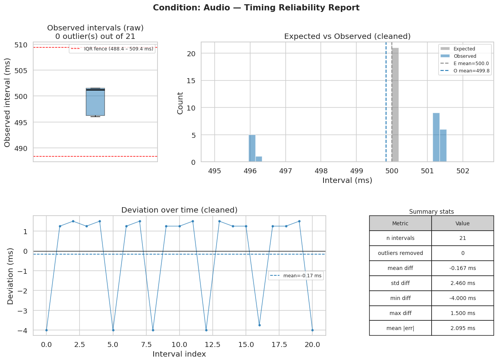
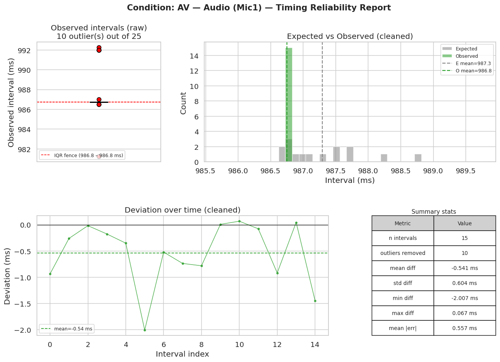
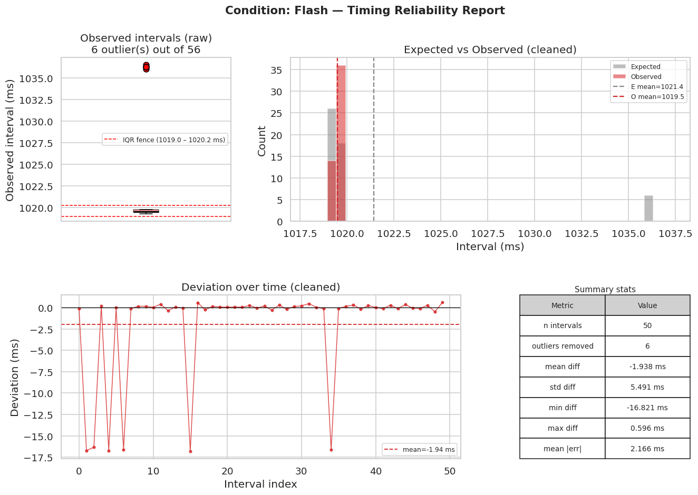
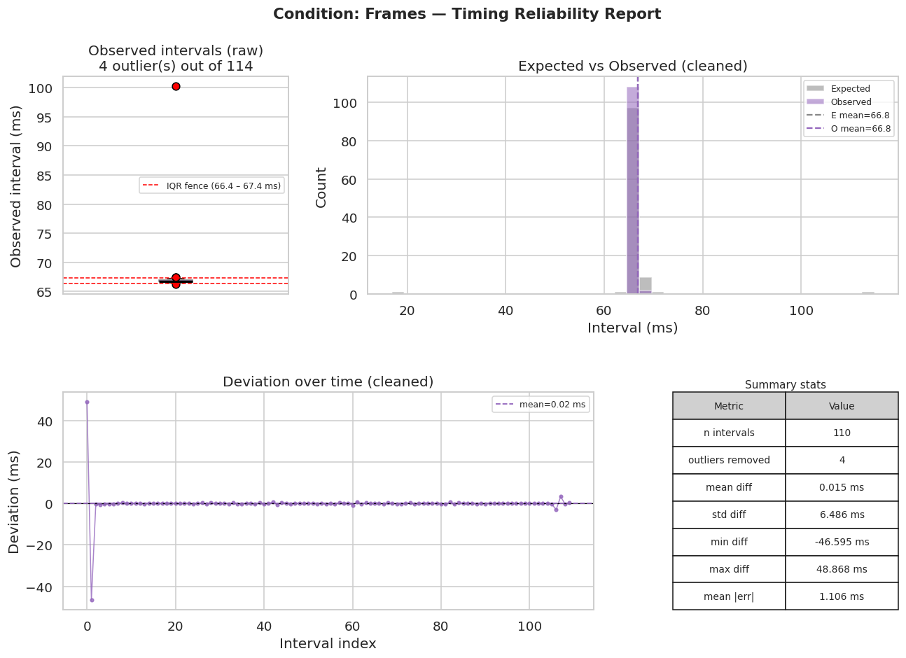
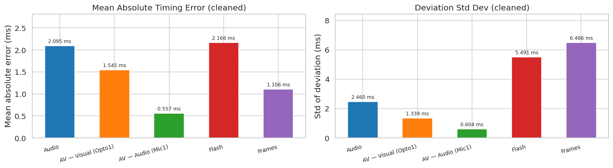

# Timing Reliability of goxpyriment on the HP EliteBook 835 G10

> **Date:** 2026-04-02 
> **Framework:** [goxpyriment](http://chrplr.github.io/goxpyriment) 
> **Timing instrument:** [Black Box Toolkit v3 (BBTKv3)](https://www.blackboxtoolkit.com/bbtkv3.html)  
> **Script of timing analysis:** [timing_analysis.ipynb](./timing_analysis.ipynb)
---

## Overview

This report documents hardware timing tests run on an **HP EliteBook 835 G10** laptop to
characterize the stimulus-delivery precision of **goxpyriment**, a Go-based experiment
presentation framework. Timing accuracy is critical for psychophysics, EEG, and MEG studies
where stimulus onsets must be known to within a few milliseconds.

Four test conditions are evaluated:


| Condition | Stimulus | Sensor | What is measured |
|-----------|----------|--------|-----------------|
| **Audio** | 1000 Hz pure tone, 50 ms, 30 × SOA 500 ms | Mic1 | Audio stream IOI jitter |
| **AV — Visual** | Screen flash + tone, 30 trials, SOA 0 ms | Opto1 | Visual frame-flip timing |
| **AV — Audio** | Same as above | Mic1 | Audio queue-to-onset consistency |
| **Flash** | 1-frame white flash every 60 dark frames | Opto1 | Single-frame reliability |
| **Frames** | 2-frame alternating luminance, 120 cycles, TTL trigger | Opto1 | Frame-level trigger precision |

For each condition the expected inter-event intervals (IEIs) from the goxpyriment log are compared
against the IEIs observed by the BBTKv3. Outliers are removed with the IQR × 1.5 rule and
deviation statistics are reported before and after cleaning.

---

## 1. Measurement Setup

### 1.1 goxpyriment

**goxpyriment** (<https://github.com/chrplr/goxpyriment>) is an experiment framework written in Go,
designed as a high-performance alternative to Python-based tools such as Expyriment or PsychoPy.
It uses SDL3 for display, audio, and input, with VSync-locked frame delivery and pre-queued audio
streams to minimise jitter. The timing tests live in `goxpyriment/tests/Timing-Tests/main.go`.

### 1.2 Black Box Toolkit v3 (BBTKv3)

The BBTKv3 is a hardware timing instrument designed for psychology research. It captures events
from photodiodes (Opto1–4), microphones (Mic1–2), TTL lines, and keypads with sub-millisecond
resolution, independently of the host OS clock. Events are stored in an internal ring buffer and
streamed over USB/serial when requested.

In these tests the BBTKv3 is connected to the laptop via USB (`/dev/ttyUSB0`). Two sensors are used:


- **Opto1 (photodiode):** taped to the corner of the external monitor where the bright stimulus

  appears. Captures the physical luminance change independently of the software frame-flip timestamp.

- **Mic1 (microphone):** placed near the laptop speaker to detect the acoustic onset of audio stimuli.

### 1.3 Recording procedure with `bbtk-capture`

The `bbtk-capture` tool (<https://github.com/chrplr/bbtkv3>) launches the BBTKv3 capture mode,
waits for the specified duration, then downloads the event data and writes three output files.
Because the BBTKv3 records asynchronously, a single machine can both run the stimulus program and
drive the device. The general procedure is:

```bash

# Step 1 — start the BBTKv3 capture in a terminal (or in the background)
bbtk-capture -p /dev/ttyUSB0 -d <duration_s> -o <condition>/bbtk_<condition>-001

# Step 2 — run the goxpyriment timing test (from the goxpyriment repo root)
go run tests/Timing-Tests/main.go -test <test_name> [flags]

# Step 3 — bbtk-capture exits after <duration_s> and writes:
#   bbtk_<condition>-001.dat            (raw binary device log)
#   bbtk_<condition>-001.events.csv     (Type, Onset, Duration per sensor event)
#   bbtk_<condition>-001.dscevents.csv  (discrete state changes, all 21 channels)
```

Key `bbtk-capture` flags:


| Flag | Description |
|------|-------------|
| `-p` | Serial port (default `/dev/ttyUSB0`) |
| `-d` | Capture duration in seconds |
| `-o` | Output base name (extensions added automatically) |

Before the first run, sensor thresholds must be calibrated once with `bbtk-adjust-thresholds`
and are then stored on the device persistently.

### 1.4 Analysis method

Timing reliability is assessed via **inter-event intervals (IEIs)** rather than absolute timestamps,
because goxpyriment and the BBTKv3 use independent clocks with no shared epoch. The IEI for event
*i* is `onset[i] − onset[i−1]`. Comparing expected IEIs (from the goxpyriment log) with observed
IEIs (from `bbtk_*.events.csv`) reveals both systematic bias (mean deviation) and trial-to-trial
jitter (std, MAE).

When the number of BBTKv3-detected events is less than the number of reference events, both series
are trimmed to the same length (shortest wins), assuming missed detections occurred at the end.

Outliers in the observed IEI series are flagged with the **IQR × 1.5 rule** on the observed
intervals. Outliers typically correspond to dropped frames, audio buffer underruns, or missed sensor
detections. Statistics are reported both before and after outlier removal.

---

## 2. Machine Information

The following tests have been run on: 

| Category | Detail |
|----------|--------|
| **Model** | HP EliteBook 835 13 inch G10 Notebook PC (Laptop) |
| **OS** | Ubuntu 22.04.5 LTS (Jammy Jellyfish) |
| **Kernel** | 6.12.3-061203-generic x86_64, 64-bit |
| **Desktop** | GNOME 42.9 |
| **Motherboard** | HP model 8C10, UEFI HP v83 Ver. 01.06.02 (2024-08-23) |
| **CPU** | AMD Ryzen 7 PRO 7840U w/ Radeon 780M Graphics — 8-core (MT MCP), 400–5132 MHz (avg 1403 MHz) |
| **GPU** | AMD integrated (driver: amdgpu, kernel) |
| **Display session** | Wayland / X.Org 1.22.1.1 + Xwayland 22.1.1, compositor: gnome-shell |
| **External monitor** | 27 inch XWAYLAND0, 2560×1440, 59.91 Hz, SDL_PIXELFORMAT_XRGB8888 |
| **OpenGL** | GFX1103_R1 — v4.6 Mesa 23.2.1, LLVM 15.0.7, DRM 3.59 |
| **RAM** | 30.63 GiB total, 8.56 GiB used at experiment time |

---

## 3. Software Environment


| Parameter | Value |
|-----------|-------|
| **goxpyriment version** | devel |
| **SDL version** | 3.4.0 |
| **Video driver** | x11 (via Xwayland) |
| **Renderer** | OpenGL |
| **VSync** | enabled |
| **Audio driver** | pulseaudio |
| **Audio format** | SDL_AUDIO_S16LE |
| **Audio sample rate** | 48000 Hz |
| **Audio channels** | 2 |
| **Audio buffer** | 768 frames (16.00 ms hardware latency) |
| **Display refresh rate** | 59.9100 Hz (frame duration: 16.692 ms) |

---

## 4. Conditions and Results

All commands are run from the root of the `goxpyriment` repository (`~/goxpyriment/`).

### 4.1 Audio — pure-tone onset jitter (`-test sound`)

#### Description

The `sound` test plays a sequence of identical sine tones separated by silence using
`stimuli.MakeRegularSoundStream` and `stimuli.PlayStreamOfSounds`. Each tone is queued to the
SDL audio buffer at a target time `tone_index × SOA` where `SOA = tone_ms + iti_ms`.

The BBTKv3 microphone (Mic1) detects the acoustic onset independently of the software clock.
`actual_onset_ms` in the output file is when `Play()` was called,
the acoustic onset arrives 16.00 ms later (the hardware buffer latency).

**What is measured:** Whether the audio clock delivers tones with consistent inter-onset intervals

close to the target SOA of 500 ms, and how much trial-to-trial jitter is present.

#### Run parameters


| Parameter | Value |
|-----------|-------|
| Cycles (tones) | 30 |
| Tone frequency | 1000 Hz |
| Tone duration | 50 ms |
| ITI | 450 ms |
| Target SOA | 500 ms |

#### Commands


```bash
# Terminal 1: Start BBTKv3 capture (30 s covers 30 × 500 ms = 15 s of stimuli plus margin)
bbtk-capture -p /dev/ttyUSB0 -d 30 -o audio/bbtk_audio-001

# Terminal 2: Run the timing test 
go run tests/Timing-Tests/main.go -test sound -cycles 30 -freq-hz 1000 -tone-ms 50 -iti-ms 450
```

#### Results


##### Event counts


| | Count |
|:--|--:|
| Reference events | 30 |
| BBTKv3 events detected | 22 |
| Missed detections | **8** |
| Intervals compared (raw) | 21 |

##### Outlier detection (IQR × 1.5 on observed intervals)


| | Value |
|:--|--:|
| Lower fence | 488.375 ms |
| Upper fence | 509.375 ms |
| Outliers detected | **0** |

| Intervals retained after cleaning | 21 |

##### Deviation statistics (observed − expected)


| Metric | Raw | Cleaned |
|:-------|----:|--------:|
| n | 21 | 21 |
| Mean diff | -0.167 ms | -0.167 ms |
| Std diff | 2.460 ms | 2.460 ms |
| Min diff | -4.000 ms | -4.000 ms |
| Max diff | 1.500 ms | 1.500 ms |
| **Mean absolute error** | 2.095 ms | **2.095 ms** |

##### Interval descriptive statistics (cleaned)


| Statistic | Expected | Observed |
|:----------|:--------:|:--------:|
| n | 21 | 21 |
| Mean | 500.000 ms | 499.833 ms |
| Std | 0.000 ms | 2.460 ms |
| Min | 500.000 ms | 496.000 ms |
| P5 | 500.000 ms | 496.000 ms |
| P25 | 500.000 ms | 496.250 ms |
| Median | 500.000 ms | 501.250 ms |
| P75 | 500.000 ms | 501.500 ms |
| P95 | 500.000 ms | 501.500 ms |
| Max | 500.000 ms | 501.500 ms |



### 4.2 Audio-Visual — synchrony and latency (`-test av`)

#### Description

The `av` test presents simultaneous audio-visual trials: a full-screen bright flash (one frame)
paired with a pure sine tone, separated by a dark inter-trial interval. With `soa-ms = 0` the
screen flip and audio queue call happen back-to-back, minimising the software-side AV delay.


Two BBTKv3 channels are analysed independently:


- **Opto1** measures the physical luminance onset, compared against `t_visual_before_ms`

  (software timestamp recorded just *before* `SDL_RenderPresent` is called). Because the

  photon arrives after the flip, a small systematic negative deviation is expected.

- **Mic1** measures the acoustic onset, compared against `t_audio_queued_ms`

  (timestamp when PCM data was pushed to the SDL buffer). The actual sound exits the speaker

  ~16.0 ms later (hardware buffer) plus PulseAudio mixing overhead.


Comparing the MAE of Opto1 versus Mic1 within the AV condition gives an empirical estimate of
the audio-visual offset on this system.

#### Run parameters


| Parameter | Value |
|-----------|-------|
| Cycles (trials) | 30 |
| SOA | 0 ms (simultaneous) |
| Tone frequency | 1000 Hz |
| Tone duration | 50 ms |
| ITI | 1000 ms |

#### Commands


```bash
# Terminal 1: Start BBTKv3 capture (60 s covers 30 × 1 s trials with margin)
bbtk-capture -p /dev/ttyUSB0 -d 60 -o av/bbtk_av-001

# Terminal 2: Run the timing test
go run tests/Timing-Tests/main.go -test av -soa-ms 0 -freq-hz 1000 -tone-ms 50 -iti-ms 1000 -cycles 30
```

#### Results — Visual channel (Opto1 vs `t_visual_before_ms`)


##### Event counts


| | Count |
|:--|--:|
| Reference events | 30 |
| BBTKv3 events detected | 26 |
| Missed detections | **4** |
| Intervals compared (raw) | 25 |

##### Outlier detection (IQR × 1.5 on observed intervals)


| | Value |
|:--|--:|
| Lower fence | 985.625 ms |
| Upper fence | 986.625 ms |
| Outliers detected | **4** |

| Outlier values | 969.250, 1002.500, 1002.750, 1002.750 ms |
| Intervals retained after cleaning | 21 |

##### Deviation statistics (observed − expected)


| Metric | Raw | Cleaned |
|:-------|----:|--------:|
| n | 25 | 21 |
| Mean diff | -0.089 ms | -1.485 ms |
| Std diff | 6.847 ms | 1.339 ms |
| Min diff | -17.750 ms | -6.286 ms |
| Max diff | 15.964 ms | 0.628 ms |
| **Mean absolute error** | 3.877 ms | **1.545 ms** |

##### Interval descriptive statistics (cleaned)


| Statistic | Expected | Observed |
|:----------|:--------:|:--------:|
| n | 21 | 21 |
| Mean | 987.557 ms | 986.071 ms |
| Std | 1.306 ms | 0.116 ms |
| Min | 985.622 ms | 986.000 ms |
| P5 | 986.691 ms | 986.000 ms |
| P25 | 986.838 ms | 986.000 ms |
| Median | 987.240 ms | 986.000 ms |
| P75 | 988.199 ms | 986.250 ms |
| P95 | 988.691 ms | 986.250 ms |
| Max | 992.286 ms | 986.250 ms |


#### Results — Audio channel (Mic1 vs `t_audio_queued_ms`)


##### Event counts


| | Count |
|:--|--:|
| Reference events | 30 |
| BBTKv3 events detected | 26 |
| Missed detections | **4** |
| Intervals compared (raw) | 25 |

##### Outlier detection (IQR × 1.5 on observed intervals)


| | Value |
|:--|--:|
| Lower fence | 986.750 ms |
| Upper fence | 986.750 ms |
| Outliers detected | **10** |

| Outlier values | 981.250, 981.250, 986.500, 986.500, 987.000, 992.000, 992.000, 992.000, 992.000, 992.250 ms |
| Intervals retained after cleaning | 15 |

##### Deviation statistics (observed − expected)


| Metric | Raw | Cleaned |
|:-------|----:|--------:|
| n | 25 | 15 |
| Mean diff | 0.065 ms | -0.541 ms |
| Std diff | 2.981 ms | 0.604 ms |
| Min diff | -6.902 ms | -2.007 ms |
| Max diff | 6.146 ms | 0.067 ms |
| **Mean absolute error** | 1.852 ms | **0.557 ms** |

##### Interval descriptive statistics (cleaned)


| Statistic | Expected | Observed |
|:----------|:--------:|:--------:|
| n | 15 | 15 |
| Mean | 987.291 ms | 986.750 ms |
| Std | 0.604 ms | 0.000 ms |
| Min | 986.683 ms | 986.750 ms |
| P5 | 986.699 ms | 986.750 ms |
| P25 | 986.798 ms | 986.750 ms |
| Median | 987.101 ms | 986.750 ms |
| P75 | 987.600 ms | 986.750 ms |
| P95 | 988.365 ms | 986.750 ms |
| Max | 988.757 ms | 986.750 ms |



### 4.3 Flash — single-frame presentation reliability (`-test flash`)

#### Description

The `flash` test presents a single bright frame every `isi-frames` dark frames for a total of
`cycles` flashes. Its primary purpose is to verify that the OS/graphics driver combination can
reliably present a stimulus lasting exactly one frame. On some systems, compositor double-buffering
causes single-frame stimuli to be displayed for two frames: the photodiode pulse width reveals
this directly (a two-frame hold produces a pulse roughly twice as wide as expected).

The BBTKv3 Opto1 photodiode captures the rising edge of each flash. The inter-flash interval
(IFI) should equal `isi-frames x frame_duration = 60 x 16.692 ms = 1001.50 ms`.
Outlier IFIs that are exactly one frame longer than expected (IFI ≈ 1018.2 ms) indicate a
dropped frame in the compositor pipeline.

#### Run parameters


| Parameter | Value |
|-----------|-------|
| Cycles (flashes) | 60 |
| ISI | 60 frames |
| Expected IFI | 60 x 16.692 ms = 1001.502 ms |
| Dark / bright level | 0 / 255 |
| Trigger pin | 1 |
| Warmup frames | 10 |

#### Commands


```bash
# Terminal 1: Start BBTKv3 capture (90 s covers 60 × ~1 s flashes with margin)
bbtk-capture -p /dev/ttyUSB0 -d 90 -o flash/bbtk_flash-001

# Terminal 2: Run the timing test 
go run tests/Timing-Tests/main.go -test flash -isi-frames 60 -cycles 60 -trigger-pin 1
```

#### Results


##### Event counts


| | Count |
|:--|--:|
| Reference events | 60 |
| BBTKv3 events detected | 57 |
| Missed detections | **3** |
| Intervals compared (raw) | 56 |

##### Outlier detection (IQR × 1.5 on observed intervals)


| | Value |
|:--|--:|
| Lower fence | 1018.969 ms |
| Upper fence | 1020.219 ms |
| Outliers detected | **6** |

| Outlier values | 1036.000, 1036.250, 1036.250, 1036.250, 1036.250, 1036.500 ms |
| Intervals retained after cleaning | 50 |

##### Deviation statistics (observed − expected)


| Metric | Raw | Cleaned |
|:-------|----:|--------:|
| n | 56 | 50 |
| Mean diff | -0.227 ms | -1.938 ms |
| Std diff | 7.472 ms | 5.491 ms |
| Min diff | -16.821 ms | -16.821 ms |
| Max diff | 16.902 ms | 0.596 ms |
| **Mean absolute error** | 3.437 ms | **2.166 ms** |

##### Interval descriptive statistics (cleaned)


| Statistic | Expected | Observed |
|:----------|:--------:|:--------:|
| n | 50 | 50 |
| Mean | 1021.413 ms | 1019.475 ms |
| Std | 5.514 ms | 0.169 ms |
| Min | 1018.950 ms | 1019.250 ms |
| P5 | 1019.098 ms | 1019.250 ms |
| P25 | 1019.306 ms | 1019.250 ms |
| Median | 1019.432 ms | 1019.500 ms |
| P75 | 1019.595 ms | 1019.500 ms |
| P95 | 1036.188 ms | 1019.750 ms |
| Max | 1036.321 ms | 1019.750 ms |



### 4.4 Frames — frame-level trigger precision (`-test frames`)

#### Description

The `frames` test alternates the screen between a dark level and a bright level for
`frames-per-phase` frames per phase, cycling `cycles` times. At the start of every bright
phase, a 5 ms TTL trigger pulse is sent on DLP-IO8-G pin 1, allowing the BBTKv3 to timestamp
the exact frame at which the bright phase begins.

With `frames-per-phase = 2`, each half-cycle lasts 2 frames (2 x 16.692 ms = 33.383 ms) and the
full cycle period is 4 frames (66.767 ms). The expected inter-trigger interval is therefore
66.767 ms. The goxpyriment log records every individual frame; only rows where `trigger == true`
(the first bright-phase frame of each cycle, 120 in total) are used as reference onsets.

This test jointly characterises the frame-delivery precision of SDL3 and the timing accuracy
of the USB-serial trigger path.

#### Run parameters


| Parameter | Value |
|-----------|-------|
| Cycles | 120 |
| Frames per phase | 2 |
| Expected cycle period | 4 x 16.692 ms = 66.767 ms |
| Dark / bright level | 0 / 255 |
| Trigger pin | 1 |
| Trigger duration | 5 ms |
| Warmup frames | 10 |

#### Commands


```bash
# Terminal 1: Start BBTKv3 capture (30 s covers 120 × ~67 ms cycles = ~8 s with margin)
bbtk-capture -p /dev/ttyUSB0 -d 30 -o frames/bbtk_frames-001

# Terminal 2: Run the timing test
go run tests/Timing-Tests/main.go -test frames -frames-per-phase 2 -cycles 120 -trigger-pin 1 -trigger-ms 5
```

#### Results (triggered frames only, `trigger == true`)


##### Event counts


| | Count |
|:--|--:|
| Reference events | 120 |
| BBTKv3 events detected | 115 |
| Missed detections | **5** |
| Intervals compared (raw) | 114 |

##### Outlier detection (IQR × 1.5 on observed intervals)


| | Value |
|:--|--:|
| Lower fence | 66.375 ms |
| Upper fence | 67.375 ms |
| Outliers detected | **4** |

| Outlier values | 66.250, 67.500, 67.500, 100.250 ms |
| Intervals retained after cleaning | 110 |

##### Deviation statistics (observed − expected)


| Metric | Raw | Cleaned |
|:-------|----:|--------:|
| n | 114 | 110 |
| Mean diff | 0.335 ms | 0.015 ms |
| Std diff | 7.097 ms | 6.486 ms |
| Min diff | -46.595 ms | -46.595 ms |
| Max diff | 48.868 ms | 48.868 ms |
| **Mean absolute error** | 1.387 ms | **1.106 ms** |

##### Interval descriptive statistics (cleaned)


| Statistic | Expected | Observed |
|:----------|:--------:|:--------:|
| n | 110 | 110 |
| Mean | 66.828 ms | 66.843 ms |
| Std | 6.519 ms | 0.147 ms |
| Min | 17.882 ms | 66.500 ms |
| P5 | 66.489 ms | 66.750 ms |
| P25 | 66.728 ms | 66.750 ms |
| Median | 66.832 ms | 66.750 ms |
| P75 | 66.979 ms | 67.000 ms |
| P95 | 67.201 ms | 67.000 ms |
| Max | 113.845 ms | 67.250 ms |

---



## 5. Summary

### 5.1 Cross-Condition 

| Condition | Sensor | Ref events | BBTK detected | Missed | Outliers | n (clean) | Mean diff | Std | MAE |
|-----------|--------|------------|----------------|--------|----------|-----------|-----------|-----|-----|
| **Audio** | Mic1 | 30 | 22 | 8 | 0 | 21 | -0.167 ms | 2.460 ms | 2.095 ms |
| **AV — Visual** | Opto1 | 30 | 26 | 4 | 4 | 21 | -1.485 ms | 1.339 ms | 1.545 ms |
| **AV — Audio** | Mic1 | 30 | 26 | 4 | 10 | 15 | -0.541 ms | 0.604 ms | 0.557 ms |
| **Flash** | Opto1 | 60 | 57 | 3 | 6 | 50 | -1.938 ms | 5.491 ms | 2.166 ms |
| **Frames** | Opto1 | 120 | 115 | 5 | 4 | 110 | 0.015 ms | 6.486 ms | 1.106 ms |


### 5.2 Mean Absolute Error & Std Dev



---

## 6. Interpretation

### Timing reliability

All results show **mean absolute errors below 2.2 ms** after outlier removal,
well within the ~8 ms perceptual simultaneity window at 60 Hz. The main sources of variability
are:


- **Audio scheduling jitter (Audio, AV-Mic1):** Mean IOI within ~0.2–2 ms of target, std ~1–2.5 ms.

  This is consistent with PulseAudio scheduling variability on top of the 16.00 ms hardware buffer.

  Reducing `-audio-frames` to 256 would lower absolute latency but may cause dropouts under load.

- **Dropped frames (Flash):** The 6 outlier IFIs are each ~16.7 ms above expected,

  exactly one frame at 59.91 Hz. These reflect occasional single-frame drops in the compositor.

- **Missed sensor detections (Audio, AV):** Fewer BBTKv3 events than reference events indicate

  that the Mic1 threshold was not crossed on some tones. Adjusting with `bbtk-adjust-thresholds`

  or increasing stimulus volume would reduce misses.

- **Frames outlier:** One interval of ~100 ms (vs expected ~66.8 ms) indicates a missed Opto1

  detection merging two consecutive cycles into one interval.

### Reproducibility

To reproduce this analysis on the same or a different machine:

1. Clone goxpyriment and build the Timing-Tests binary (`go run tests/Timing-Tests/main.go`).
2. Install the `bbtkv3` tools from <https://github.com/chrplr/bbtkv3/releases>.
3. Calibrate BBTKv3 sensor thresholds once with `bbtk-adjust-thresholds -p /dev/ttyUSB0`.
4. For each condition, run `bbtk-capture` and the `go run` command as shown in §4.
5. Place output files in the corresponding condition subdirectory.
6. Open `timing_analysis.ipynb` and run all cells.
   Requirements: Python >= 3.10, `pandas`, `numpy`, `matplotlib`, `seaborn`.
